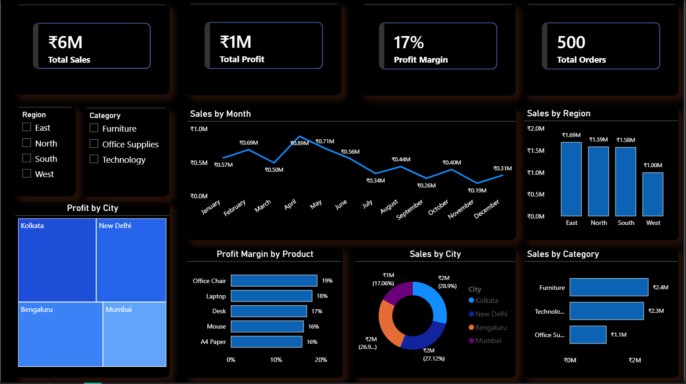

# 📊 Sales Performance Dashboard | Power BI

## 📌 Project Overview

This is my Power BI dashboard project, developed as part of my Data Analytics learning journey. The dashboard provides an interactive analysis of sales data, enabling users to explore business performance through dynamic visualizations, KPIs, and filters.

The objective of this project was to transform raw sales data into meaningful business insights using Power BI's data modeling, DAX, and visualization capabilities.

---

## 🖼️ Dashboard Preview

> **Dashboard Screenshot**



---

## 🎯 Project Objectives

- Analyze overall sales performance.
- Track sales across different regions and cities.
- Compare sales across product categories.
- Analyze profit generated from sales.
- Monitor monthly sales trends.
- Identify top-performing products.
- Evaluate regional business performance.
- Build an interactive dashboard using slicers and filters.

---

## 📈 Key Performance Indicators (KPIs)

- 💰 Total Sales
- 💵 Total Profit
- 📊 Profit Margin
- 🛒 Total Orders

---

## 📊 Dashboard Features

- Interactive KPI Cards
- Monthly Sales Trend Analysis
- Region-wise Sales Comparison
- Category-wise Sales Analysis
- City-wise Sales Distribution
- Profit Contribution Analysis
- Product Profit Margin Analysis
- Dynamic Filters & Slicers
- Interactive Report Navigation

---

## 🛠️ Tools & Technologies

- Power BI Desktop
- Power Query
- DAX (Data Analysis Expressions)
- Data Modeling
- Microsoft Excel

---

## 📂 Repository Structure

```text
📂 Sales-Performance-PowerBI-Dashboard
│
├── 📂 Dataset
│   └── Sales Data.xlsx
│
├── 📂 PowerBI_Project
│   └── Sales_dashboard.pbix
│
├── 🖼️ Dashboard.PNG
│
└── 📄 README.md
```

---

## 🚀 How to Use

1. Clone or download this repository.
2. Open the `.pbix` file using **Power BI Desktop**.
3. Refresh the dataset if required.
4. Explore the dashboard using the available slicers and filters.

---

## 💡 Skills Demonstrated

- Data Cleaning
- Data Transformation
- Data Modeling
- DAX Measures
- Dashboard Design
- Interactive Visualizations
- Business Intelligence
- Data Analysis
- Storytelling with Data

---

## 📚 Learning Outcomes

Through this project, I gained hands-on experience with:

- Building interactive dashboards in Power BI.
- Creating meaningful KPI cards.
- Working with DAX measures.
- Designing professional dashboard layouts.
- Creating interactive reports and visualizations.
- Converting raw sales data into actionable insights.

This project helped strengthen my understanding of business intelligence and dashboard development using Power BI.

---

## 📌 Future Improvements

- Add more advanced DAX measures.
- Improve dashboard responsiveness.
- Include drill-through pages.
- Add forecast and trend analysis.
- Optimize performance for larger datasets.

---

## 👨‍💻 Author

**Kamlesh Lohar**

Aspiring Data Analyst passionate about transforming data into actionable insights through visualization, analytics, and business intelligence.

### Skills

- SQL
- Power BI
- Excel
- Python (Pandas, NumPy)

---

⭐ If you found this project helpful or interesting, feel free to give this repository a **Star**.
